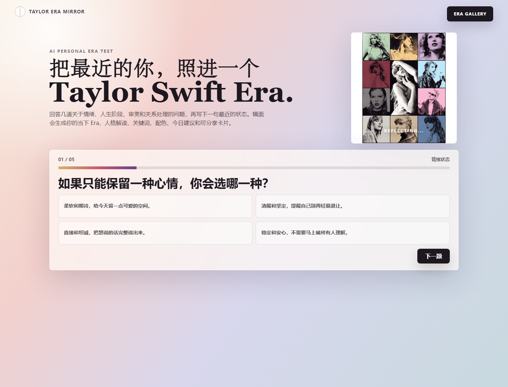
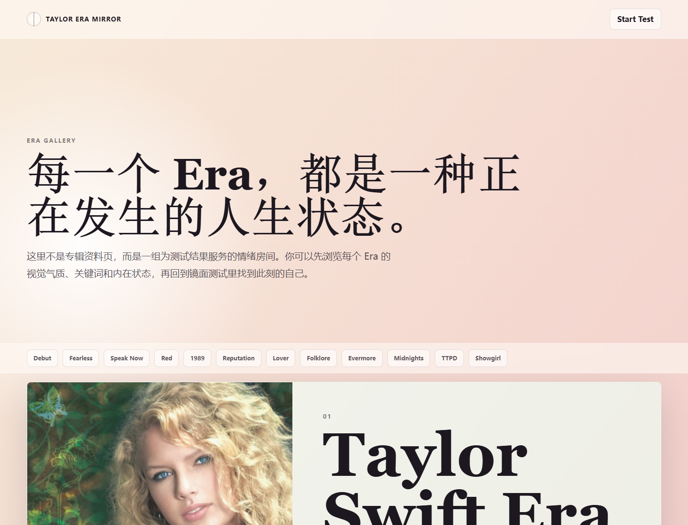
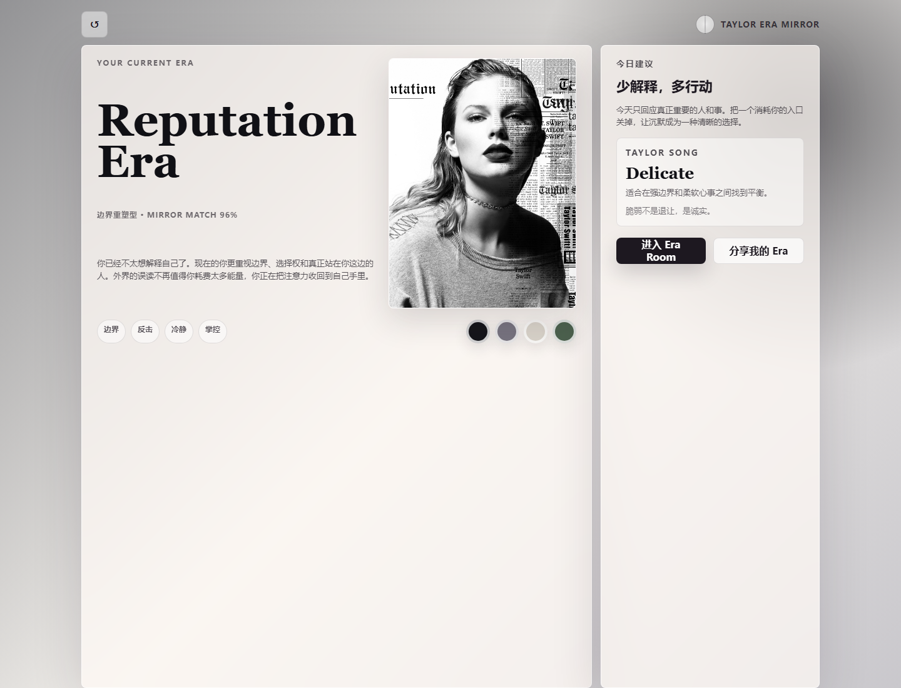
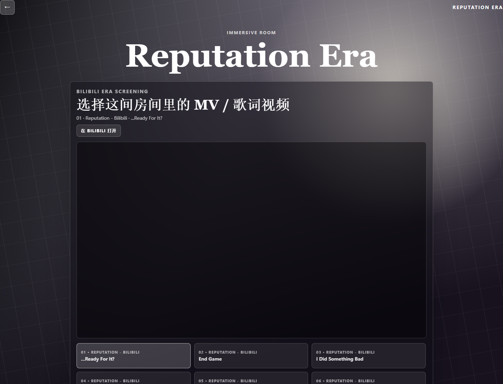

# Taylor Era Mirror

Taylor Era Mirror 是一个 Taylor Swift Era 主题的个性化测试网页。用户回答几道关于情绪、人生阶段、审美偏好和关系处理的问题，再写下一句最近状态，页面会生成当前最接近的 Era、人格解读、关键词、专属配色、今日建议、歌曲建议、分享卡和沉浸式 Era Room。

项目本体是静态网页，可以直接部署到 GitHub Pages。AI 个性化生成通过 CloudBase 云函数代理完成；如果没有配置 AI 后端，页面会自动回退到本地规则结果。

## 页面预览

### 首页 / 测试入口



### Era Gallery



### 测试结果



### 分享卡


### Era Room



## 功能

- 个性化 Era 测试：根据选择题和最近状态生成当前 Era。
- AI / 本地规则双模式：优先请求 AI 后端，失败时自动使用本地规则。
- Era Gallery：浏览每个 Era 的视觉气质、关键词和状态描述。
- 结果页：展示 Era 解读、匹配度、关键词、配色、今日建议和歌曲建议。
- 分享卡：用 Canvas 生成可下载的个人 Era 海报。
- Era Room：根据结果进入沉浸式房间，并展示对应的 Bilibili 视频入口。
- 静态部署：适合 GitHub Pages、CloudBase 静态网站托管、Cloudflare Pages、Vercel 等平台。

## 本地运行

这个项目不依赖复杂构建流程。

```bash
npm run dev
```

然后打开：

```text
http://127.0.0.1:5188
```

也可以直接用浏览器打开 `index.html` 预览纯静态页面。


## AI 后端配置

前端不能直接保存或调用 AI API key。这个项目的推荐结构是：

```text
GitHub Pages 静态前端 -> CloudBase 云函数 -> DashScope / 百炼模型 API
```

前端只知道 CloudBase 云函数的 HTTP 地址，真正的 `DASHSCOPE_API_KEY` 只放在 CloudBase 云函数运行环境里。

### 1. 创建 DashScope / 百炼 API Key

在阿里云 DashScope / 百炼控制台创建自己的 API key。创建后只复制一次，不要提交到 GitHub。

### 2. 部署 CloudBase 云函数

项目里的示例云函数在：

```text
cloudfunctions/era-ai/
```

它会读取环境变量，然后调用 DashScope OpenAI-compatible API。

如果使用仓库里的 `cloudbase.config.yml` 部署，需要把 `CLOUDBASE_ENV_ID` 换成你自己的 CloudBase 环境 ID，或者在部署参数里传入：

```text
CLOUDBASE_ENV_ID=你的 CloudBase 环境 ID
```

### 3. 配置云函数环境变量

在 CloudBase 控制台中进入你的环境，找到 `era-ai` 云函数，打开环境变量配置，添加：

```text
DASHSCOPE_API_KEY=你的 DashScope API key
BAILIAN_MODEL=qwen-plus
BAILIAN_BASE_URL=https://dashscope.aliyuncs.com/compatible-mode/v1
```

保存后重新部署或重启云函数，让环境变量生效。

### 4. 配置前端 AI 接口地址

获取 CloudBase 云函数的 HTTP 访问地址后，在 `index.html` 里配置：

```html
<script>
  window.TAYLOR_ERA_AI_ENDPOINT = "https://your-cloud-function-url";
</script>
```

仓库默认把这个值留空，避免公开你的 CloudBase 云函数地址。如果不配置这个地址，前端会默认请求 `/api/era-ai`；请求失败时，页面会使用本地规则生成结果。


## 项目结构

```text
.
├── index.html                 # 主测试页面
├── app.js                     # 测试逻辑、结果生成、分享卡、Era Room
├── styles.css                 # 主页面样式
├── era-gallery.html           # Era Gallery 页面
├── era-gallery.css            # Era Gallery 样式
├── era-gallery-bilibili.js    # Era Room 视频配置
├── assets/eras/               # Era 视觉素材
├── cloudfunctions/era-ai/     # CloudBase AI 代理云函数
└── docs/screenshots/          # README 页面截图
```

## 常用命令

```bash
npm run dev
npm run check
```

`npm run check` 会检查主要 JavaScript 文件的语法。

## 技术栈

- HTML / CSS / JavaScript
- Canvas 分享卡生成
- CloudBase 云函数
- DashScope / 百炼 OpenAI-compatible API
- GitHub Pages 静态部署
